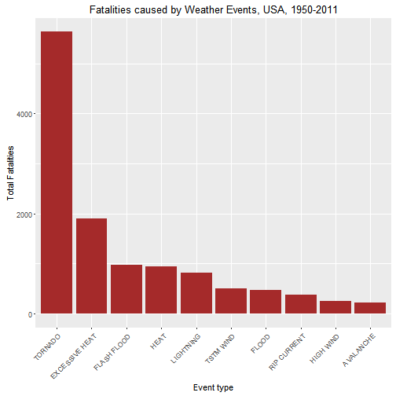
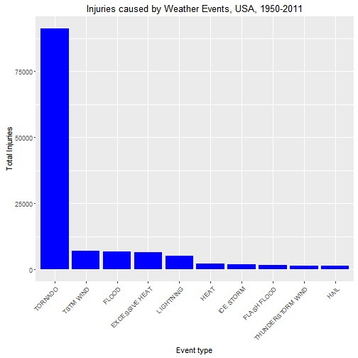
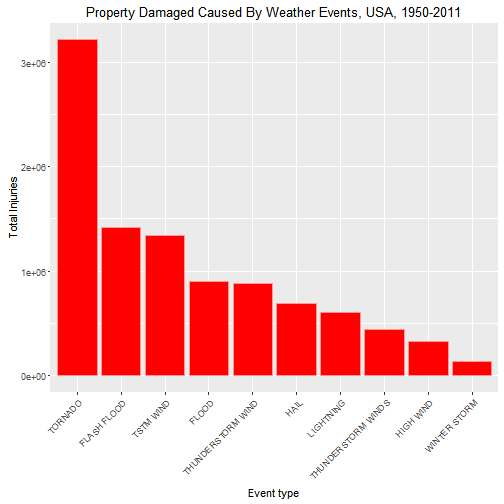

# Synopsis
This report is created based on the U.S. National Oceanic and Atmospheric Administration's (NOAA) storm database. The database tracks characteristics of major storms and weather events in the United States, including when and where they occur, as well as estimates of any fatalities, injuries, and property damage.

1. [Storm Data](https://d396qusza40orc.cloudfront.net/repdata%2Fdata%2FStormData.csv.bz2)
2. [National Weather Service Storm Data Documentation](https://d396qusza40orc.cloudfront.net/repdata%2Fpeer2_doc%2Fpd01016005curr.pdf)
3. [National Climatic Data Center Storm Events FAQ](https://d396qusza40orc.cloudfront.net/repdata%2Fpeer2_doc%2FNCDC%20Storm%20Events-FAQ%20Page.pdf)
4. The events in the database start in the year 1950 and end in November 2011. 


# Report Goals

## The main purpose of this report is to answer 2 most important questions.

1. Across the United States, which types of events are most harmful with respect to population health?
2. Across the United States, which types of events have the greatest economic consequences?

## Assumptions and Choices

1. In order to answer the questions (refer above), we are taking only Fatalities, Injuries and Property Damage
2. All these values are estimated by National Weather Service.
3. Property Damage is expressed in 1000's 
4. In this report, we are looking at Top 10 weather events, caused more fatalities, injuries and property damage
5. ggplot is used to display the plot for all the 3 categories (fatalities, injuries and property damage). This is to maintain a similar pattern across all these categories for easy readability.
6. Top 10 is opted to show more variation among the event categories.


## Loading required libraries into RStudio environment

```r
library(knitr)
library(ggplot2)
```

#  Data Loading - Extract Data
1. Loading of existing data for analysis


```r
stormData = read.csv(bzfile("repdata-data-StormData.csv.bz2"), header = TRUE)
```

# Data Processing - Transform Data
### In order to answer the questions, we have opted to work with 3 major pieces of information for every Event Type. These are FATALITIES, INJURIES and PROPDMG


```r
# Creating a new data.frame with only required columns from the complete dataset
stormData2 = stormData[,c("EVTYPE", "FATALITIES", "INJURIES", "PROPDMG")]
summary(stormData2)
```

```
##                EVTYPE         FATALITIES          INJURIES        
##  HAIL             :288661   Min.   :  0.0000   Min.   :   0.0000  
##  TSTM WIND        :219940   1st Qu.:  0.0000   1st Qu.:   0.0000  
##  THUNDERSTORM WIND: 82563   Median :  0.0000   Median :   0.0000  
##  TORNADO          : 60652   Mean   :  0.0168   Mean   :   0.1557  
##  FLASH FLOOD      : 54277   3rd Qu.:  0.0000   3rd Qu.:   0.0000  
##  FLOOD            : 25326   Max.   :583.0000   Max.   :1700.0000  
##  (Other)          :170878                                         
##     PROPDMG       
##  Min.   :   0.00  
##  1st Qu.:   0.00  
##  Median :   0.00  
##  Mean   :  12.06  
##  3rd Qu.:   0.50  
##  Max.   :5000.00  
## 
```

### Remove any blank spaces (prefix or suffix) in EVTTYPE value 

```r
stormData2$EVTYPE <- toupper(gsub("^\\s+|\\s+$", "", stormData2$EVTYPE))
```

# Data Analysis

## Fatalities
- Group on FATALITIES column
- By Event Type 
- Sum of fatalities count
- We are making sure to filter our any records with NAs (na.rm = TRUE)
- Order by descending on the Total number of fatalities
- Getting only the Top 10 from Order List
- Creating a factor, which we will be using to plot


```r
fatalitiesData <-
        aggregate(
                stormData2$FATALITIES, 
                by=list(stormData2$EVTYPE), FUN=sum, na.rm=TRUE)
                
colnames(fatalitiesData) = c("event", "total")

fatalitiesData.sorted <- 
    fatalitiesData[order(-fatalitiesData$total),] 
    
top.fatalities <- fatalitiesData.sorted[1:10,]

# Quick Check
head(top.fatalities)
```

```
##              event total
## 750        TORNADO  5633
## 108 EXCESSIVE HEAT  1903
## 130    FLASH FLOOD   978
## 235           HEAT   937
## 410      LIGHTNING   816
## 771      TSTM WIND   504
```

```r
tail(top.fatalities)
```

```
##           event total
## 410   LIGHTNING   816
## 771   TSTM WIND   504
## 146       FLOOD   470
## 516 RIP CURRENT   368
## 312   HIGH WIND   248
## 11    AVALANCHE   224
```

```r
top.fatalities$event <- 
    factor(
        top.fatalities$event, levels=top.fatalities$event, 
        ordered=TRUE)
```

## Injuries
- Group on INJURIES column
- By Event Type 
- Sum of injuries count
- We are making sure to filter our any records with NAs (na.rm = TRUE)
- Order by descending on the Total number of Injuries
- Getting only the Top 10 from Order List
- Creating a factor, which we will be using to plot


```r
injuriesData <-
        aggregate(
                stormData2$INJURIES, 
                by=list(stormData2$EVTYPE), FUN=sum, na.rm=TRUE)
                
colnames(injuriesData) = c("event", "total")

injuriesData.sorted <- 
    injuriesData[order(-injuriesData$total),] 
    
top.injuries <- injuriesData.sorted[1:10,]

# 
head(top.injuries)
```

```
##              event total
## 750        TORNADO 91346
## 771      TSTM WIND  6957
## 146          FLOOD  6789
## 108 EXCESSIVE HEAT  6525
## 410      LIGHTNING  5230
## 235           HEAT  2100
```

```r
tail(top.injuries)
```

```
##                 event total
## 410         LIGHTNING  5230
## 235              HEAT  2100
## 379         ICE STORM  1975
## 130       FLASH FLOOD  1777
## 677 THUNDERSTORM WIND  1488
## 204              HAIL  1361
```

```r
top.injuries$event <- 
    factor(
        top.injuries$event, levels=top.injuries$event, 
        ordered=TRUE)
```

## Property Damage
- Group on PROPDMG column
- By Event Type 
- Sum of Property Damage (estimated in 1000s)
- We are making sure to filter our any records with NAs (na.rm = TRUE)
- Order by descending on the total value of estimated property damage
- Getting only the Top 10 from Order List
- Creating a factor, which we will be using to plot
- Calculating the overall property damage in billions


```r
propdmgData <-
        aggregate(
                stormData2$PROPDMG, 
                by=list(stormData2$EVTYPE), FUN=sum, na.rm=TRUE)
                
colnames(propdmgData) = c("event", "total")

propdmg.sorted <- propdmgData[order(-propdmgData$total),] 

top.propdmg <- propdmg.sorted[1:10,]

top.propdmg$event <- 
    factor(
        top.propdmg$event, levels=top.propdmg$event, 
        ordered=TRUE)

# Total Damage in Billions
totalDamagae <- round(sum(top.propdmg$total) * 0.000001)
```

# Data Presentation 

## Top 10 Weather Evets for Fatalities

```r
ggplot(data=top.fatalities, aes(x=event, y=total)) + 
     geom_bar(stat="identity",fill="brown") + xlab("Event type") + ylab("Total Fatalities") + 
     ggtitle("Fatalities caused by Weather Events, USA, 1950-2011") +
     theme(axis.text.x = element_text(angle = 45, hjust = 1))
```



## Top 10 Weather Evets for Injuries


```r
ggplot(data=top.injuries, aes(x=event, y=total)) + 
     geom_bar(stat="identity", fill="blue") + xlab("Event type") + ylab("Total Injuries") + 
     ggtitle("Injuries caused by Weather Events, USA, 1950-2011") +
     theme(axis.text.x = element_text(angle = 45, hjust = 1))
```



## Top 10 Weather Evets for Property Damage


```r
ggplot(data=top.propdmg, aes(x=event, y=total)) + 
     geom_bar(stat="identity", fill="red", color="#FF9999") + xlab("Event type") + ylab("Total Injuries") + 
     ggtitle("Property Damaged Caused By Weather Events, USA, 1950-2011") +
     theme(axis.text.x = element_text(angle = 45, hjust = 1))
```



Based on the data and analysis, around 10 Billion dollars of property damage was caused by Top 10 Weather events from 1950 to 2011 in United State of America. Clearly **Tornadoes** caused most number of **fatalities**, **injuries** and **heavy damage to the properties.**


Note that the `echo = FALSE` parameter was added to the code chunk to prevent printing of the R code that generated the plot.
